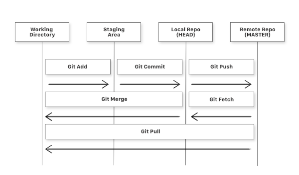
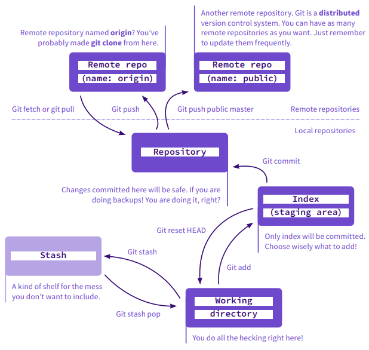
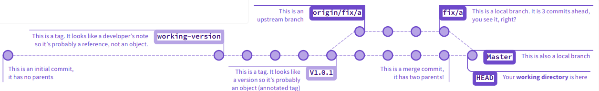
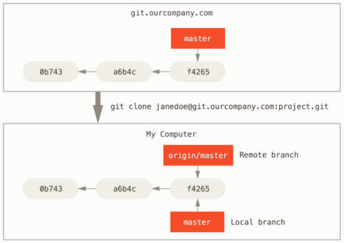
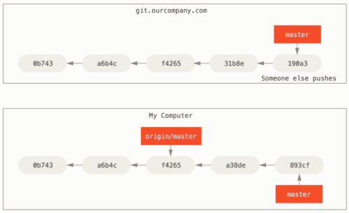
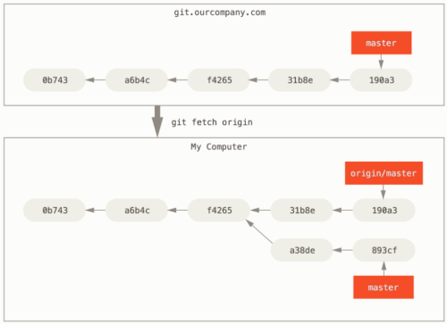
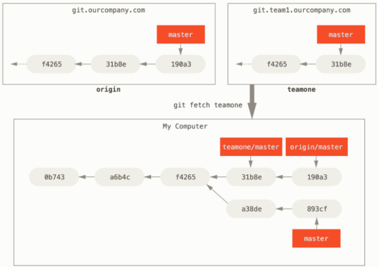

# **Git Cheat Sheet**

[Git Documentation](https://git-scm.com/doc "Visit")

## **Table of Contents**

- [**Git Cheat Sheet**](#git-cheat-sheet)
   - [**Table of Contents**](#table-of-contents)
   - [**Basic Workflow**](#basic-workflow)
   - [**Scenarios**](#scenarios)
      - [**Configuration**](#configuration)
      - [**Clone a Repository**](#clone-a-repository)
      - [**Clean a Repository**](#clean-a-repository)
      - [**Add Existing File Structure**](#add-existing-file-structure)
      - [**Logging**](#logging)
      - [**Stashing**](#stashing)
      - [**Working with Remotes**](#working-with-remotes)
         - [**Git Fetch**](#git-fetch)
         - [**Git Pull**](#git-pull)
      - [**Branching**](#branching)
      - [**Merging and Resolving Conflicts**](#merging-and-resolving-conflicts)
      - [**Tagging**](#tagging)
      - [**Create Private Fork**](#create-private-fork)
      - [**Working with Submodules**](#working-with-submodules)
         - [**Add a Submodule**](#add-a-submodule)
         - [**Update a Submodule**](#update-a-submodule)
         - [**Remove a Submodule**](#remove-a-submodule)
         - [**Move a Submodule**](#move-a-submodule)
      - [**Common Mistakes**](#common-mistakes)
         - [**Modify Last Commit**](#modify-last-commit)
         - [**Unstage Files**](#unstage-files)
         - [**Undo Modifications**](#undo-modifications)
         - [**Remove Commits**](#remove-commits)
      - [**Large File Storage**](#large-file-storage)
         - [**Abstract**](#abstract)
   - [](#)

## **Basic Workflow**







## **Scenarios**

### **Configuration**

Global configuration (used as default across all local repositories, unless overwritten):

```shell
$ cat ~/.gitconfig                                    # global configurations
$ git config --list --show-origin --show-scope
$ git config --get-regexp <pattern>                   # this only filters config names
$ git config --list | grep <pattern>                  # this matches values too
$ # powershell:
$ # git config --list | Out-String -Stream | Select-String <pattern>
$ git config --global user.name "<first-name> <last-name>"
$ git config --global user.email "<email>"
$ git config --global core.editor "code --wait"
$ git config --global diff.tool vscode
$ git config --global difftool.vscode.cmd "code --wait --diff $LOCAL $REMOTE"
$ git config --global merge.tool vscode
$ git config --global mergetool.vscode.cmd 'code --wait $MERGED'
$ git config --global merge.conflictStyle diff3       # use 3 way diff instead 2
$ # use '--pune' when fetching, deleting remote references that were removed from the upstream
$ git config --global fetch.prune true
$ # by default 'push' updates all branches that have
$ # the same name on the remote, this config limits that
$ git config --global push.default tracking

$ # create alias 'git up'
$ # the "!" tells Git to run it as a shell command and not a 'git *' command
$ git config --global alias.up '!git remote update --prune; git merge --ff-only @{u}'
```

### **Clone a Repository**

```shell
$ git clone --branch <branch-name> <remote-repository>.git <project-folder>
```



> _When you clone a repository, Git automatically connects your local branch with a remote-tracking branch that tracks `origin/<brach-name>`. If you're on a local "tracking branch", Git automatically knows which server to fetch from and which branch to merge in (also called "upstream")._
>
> _To rename your remote from the default `origin`, you can use the `--origin <custom-origin-name>` option._
>
> _You can use the `--recurse-submodules -j8` options to recursively initialize all submodules fetching up to 8 submodules at the same time._

### **Clean a Repository**

```shell
$ git clean -x -d -ff
```

- `-x`: don't use `.gitignore` rules
- `-d`: have `clean` recurse into untracked directories
- `-f`: force, `clean` will only modify untracked **nested** Git repositories if a second `-f` is given
  - the second `-f` is especially useful, when switching branches that have distinct submodules

### **Add Existing File Structure**

```shell
$ cd <project-folder>
$ git init --branch <branch-name>      # defaults to 'main'
$ git add .
$ git commit --message "Initial commit"
```

To also push to a remote:

```shell
$ git remote add <origin> <remote-repository>.git
$ git remote --verbose                 # just list remotes to ensure everything went well
$ git push <origin> <branch-name>
```

### **Logging**

```shell
$ git show <object>                          # '<object>' defaults to 'HEAD', can be of commit ID, branch name,
$                                            # or other revision reference
$ git show :/<regex>                         # filter 'show' with regular expressions
$ git log --graph --decorate                 # '--graph' draws a text based graph of commits on left side of messages
$ git log --author "<pattern>"               # commits by matching author
$ git log --grep "<pattern>"                 # commits by matching commit message
$ git log --patch                            # '--patch' generates patch text for listed changes
$ git log -- <file>                          # display commits that have the specified file
$                                            # note double dash meaning end of command options, after which only
$                                            # positional arguments are accepted
$ git log <since>..<until>                   # commits that occur between <since> and <until>
$                                            # args can be of commit ID, branch name, HEAD, or other revision reference
$ git log --stat --pretty --graph --patch    # '--stat' adds details on changed files and their -lines
$ git reflog show                            # alias for 'git log -g --abbrev-commit --pretty=oneline'
$ git diff                                   # show workspace changes to staged files
$ git diff --cached                          # show staged changes to repository files
$ git diff --word-diff                       # show highlighted inline word changes
$ git name-rev --name-only <commit-sha>      # find position of a commit relative to tags, will return
$                                            # returns <tag-name>~<commit-num-before-tag>
```

### **Stashing**

Use `stash` when you want to record the state of the working directory and index for later use, but need to go back to a clean working directory for now.

```shell
$ git stash                # store changes in your workspace into a stash for later use
$ git stash pop            # apply stored stash into workspace, and clear stash
$ git stash drop           # delete a specific stash
```

### **Working with Remotes**

- A remote-tracking branch is a local reference to the state of a remote branch, and is used to follow changes from another repository. Remote-tracking branches should not contain direct modifications or have local commits made to them.
- When you `clone` a repository, or `checkout` a branch, Git automatically connects your local branch with a remote-tracking branch that tracks `<remote>/<brach-name>`. If you're on a such local "tracking branch", Git automatically knows which server to fetch from and which branch to merge in (also called "upstream").

To get detailed information on your remote repository and remote-tracking branches run:

```shell
$ git remote show <origin>
$ git ls-remote <origin>
$ git reflog show
```

> _It's important to note that these logs are from what Git has cached the last time you `fetch`-ed from each server. If you want totally up to date information, you'll need to `fetch` from all your remotes right before running these._

#### **Git Fetch**



To update the cached state of remote-tracking branches of a given remote run:

```shell
$ git fetch --prune <remote>           # '--pune' deletes remote references that were removed from the upstream
$ git fetch -all --prune --verbose     # '--all' fetches from every remote repository, useful with forks
```



This will not touch your local branch, to integrate those remote changes, you would have to `merge` the remote-tracking branch to your local one yourself.

> _The name 'origin' means nothing special, it is just the default name for the remote in Git. A local repository might have more than one remotes named differently:_
>
> 

#### **Git Pull**

While the `fetch` command will not modify your working directory, `pull` is essentially a `fetch` immediately followed by a `merge` (in most cases). If you have a tracking branch set up, either by explicitly setting it or by having it created for you by the `clone` or `checkout` commands, `pull` will look up what server and branch your current branch is tracking, `fetch` from that server and then try to merge in the changes:

```shell
$ git pull <remote>
```

### **Branching**

To list branches:

```shell
$ git branch                           # list local branches, equivalent of 'git branch --list'
$ git branch --list                    # list local branches
$ git branch --remote                  # list remote branches, equivalent of 'git branch --list --remote'
$ git branch --all                     # list both local and remote branches, equivalent of 'git branch --list --all'
$ git branch --list *dev*              # list local branches that match patten
$ git branch --list --all origin/dev*  # list remote branches that match patten ('--list' must be present when using pattern)
$ git branch --remote --verbose        # including last cached commit message in logs
```

To create a new branch from the current commit:

```shell
$ git branch <new-branch-name>
$ git checkout <new-branch-name>

$ git checkout -b <new-branch-name>    # shorthand for above two commands

$ git push <origin> <new-branch-name>  # to propagate your work on the server
```

To check out an existing branch:

```shell
$ git checkout <existing-branch-name>
```

> _When you check a branch out from a remote repository the first time, Git automatically connects your new local branch with a remote-tracking one that tracks `origin/<brach-name>`. If you're on such a local "tracking branch", Git automatically knows which server to fetch from and which branch to merge in (also called "upstream")._

To delete a branch:

```shell
$ git brach --delete <branch-name>

$ git push <origin> --delete <branch-name>  # to delete branch on the server too
```

To rename a branch:

```shell
$ git branch --move <old-branch> <new-branch>
$ git push <origin> <new-branch>             # to propagate your work on the server
$ git push <origin> --delete <old-branch>    # to delete branch on the server
```

To create a branch without history:

```shell
$ cd <project-folder>
$ git checkout --orphan <new-branch-name>
$ git commit
$ git push --set-upstream origin <new-branch-name>
```

### **Merging and Resolving Conflicts**

```shell
$ git checkout -b hotfix               # shorthand for branch & checkout commands
$ # work
$ git commit --all --message "Hotfix"  # --all automatically stages modified (including deleted) files, but not new ones
$ git push origin hotfix
$ # code review
$ git checkout master
$ git merge hotfix                     # you can use the '--no-commit' option, to disable auto-committing on success
$ # resolve merge conflicts, then commit changes if automatic merge was interrupted
$ git push origin master
$ git branch --delete hotfix
$ git push origin --delete hotfix
```

- A merge conflict is an event that takes place when Git is unable to automatically resolve differences in code between two commits. Git can merge changes automatically only if the foreign commits' changes are on different lines in the branch than you worked on.

- Failure during the merge process indicates conflict(s). Git resolves of the changes as much as possible, but conflicting changes will remain in files to be resolved manually, marked like this:

  ```
  <<<<<<<
  Changes on the local branch that is being merged into.
  |||||||
  The common ancestor version.
  =======
  Changes on the remote-tracking branch that is being merged in.
  >>>>>>>
  ```

  > _If you don't see the common ancestor part, be sure your configuration uses 3-way diff:_
  >
  > _`git config merge.conflictStyle diff3`_

- To merge the changes manually resolving the conflicts:

  ```shell
  $ git remote update --prune
  $ git merge --ff-only <upstream-branch>             # merge only, if fast-forward is possible
  $                                                   # (aka. workspace hasn't diverged)
  # if it fails
  $ git rebase --preserve-merges <upstream-branch>    # preserve merges prevents 'rebase' from
  $                                                   # linearizing the commits being rebased
  ```

  > _If you `rebase` a merged feature branch without `--preserve-merges`, every commit on the feature branch would be duplicated on master as part of the linearization done by `rebase`._
  >
  > asd

### **Tagging**

To create annotated tags, run:

```shell
$ git tag                           # list all tags
$ git tag --annotate <tag-name> --message <tag-message> <commit-sha>
$                                   # create annotated tag in workspace
$ git tag --delete <tag-name>       # remove a tag from workspace

$ git push <remote> --follow-tags   # to propagate annotated tag changes in repository
$ git push <remote> --tags          # to propagate both lightweight and annotated tag changes in repository
```

> _It's not recommended to use lightweight tags, since _

### **Create Private Fork**

A `fork` is a copy of someone else's repository that you manage. It lets you make changes to a project without affecting the original repository, while you can still `fetch` updates from, or submit changes to the original "upstream" repository.

1. Clone bare repository to a temporary folder:

   ```shell
   $ git clone --bare <remote-repository>.git <tmp-folder>
   ```

   > _You may want to clone a specific branch using `--branch <branch-name>`._

1. Mirror-push the bare clone to your private repository:

   ```shell
   $ cd <tmp-folder>
   $ git push --mirror <private-repository>.git
   ```

1. Delete the temporary folder, then clone your private repository where it suits you:

   ```shell
   $ cd ..
   $ rm -rf <tmp-folder>
   $ # powershell:
   $ # Remove-Item -Recurse -Force  <tmp-folder>
   $ cd ~/<work>
   $ git clone <private-repository>.git <project-folder>
   ```

1. Add the original repository as remote, so you can fetch future changes from upstream:

   ```shell
   $ cd <project-folder>
   $ git remote add upstream <remote-repository>.git
   $ git remote set-url --push upstream DISABLE       # disable pushing to upstream
   ```

### **Working with Submodules**

#### **Add a Submodule**

```shell
$ git submodule add --branch <branch-name> <submodule-repository>.git <submodule-folder>
```

To also add extra remote, so you can fetch future changes from upstream:

```shell
$ cd <submodule-folder>
$ git remote add upstream <remote-repository>.git
$ git remote --verbose                                # just list remotes to ensure everything went well
$ git remote set-url --push upstream DISABLE          # disable pushing to upstream
```

#### **Update a Submodule**

```shell
$ git submodule update --init <submodule-folder>
```

> _To update all submodules present in current repository simply do not specify `<submodule-folder>`._
>
> _To recursively update all submodules that are part of your project, you can use the `--recursive` option:_
>
> `$ git submodule update --init --recursive`\_

#### **Remove a Submodule**

To remove a submodule from your local project, you can de-initialize it (eg. when finished working in a specific submodule directory):

```shell
$ git submodule deinit <submodule-folder>
```

To also remove the submodule from the repository, use `rm` **after** `deinit`:

```shell
$ git rm <submodule-folder>
```

> _To deinit all submodules present in current repository simply do not specify `<submodule-folder>`._
>
> _To recursively deinit all submodules that are part of your project, you can use the `--recursive` option:_
>
> _`$ git submodule deinit --recursive`_

#### **Move a Submodule**

```shell
$ git mv <submodule-folder> <new-submodule-folder>
```

### **Common Mistakes**

#### **Modify Last Commit**

- If you've made no changes since your last commit (for instance, you run this command immediately after your previous one), then your snapshot will look exactly the same, and all you'll change is your commit message:
  ```shell
  $ git commit --amend --message "Done for good"
  ```
- If you commit and then realize you forgot to stage the changes in a file you wanted to add to this commit, you can do:
  ```shell
  $ git commit --message "Done"
  $ git add forgotten_file
  $ git commit --amend --message "Done for good"
  ```

> _When you're amending your last commit, you're not so much fixing it as replacing it entirely with a new, improved one that pushes the old commit out of the way and puts the new one in its place._

#### **Unstage Files**

To unstage files, but keep local changes:

```shell
$ git restore --staged <file>
```

#### **Undo Modifications**

To set local file's state to origin's head:

```shell
$ git restore <file>
```

#### **Remove Commits**

> _**Danger zone:** always make backup branches before using `git reset`!_

Throw away the last commit, but keep changes locally:

```shell
$ git reset HEAD^
$ git push --force origin
```

Throw away the last commit without trace:

```shell
$ git reset --hard HEAD^
$ git push --force origin
```

Throw away the last N commit without trace:

```shell
$ git reset --hard HEAD~<N>
$ git reset --hard <commit-hash>    # or reset to exact commit
$ git push --force origin
```

### **Large File Storage**

[Git LFS](https://github.com/git-lfs/git-lfs/blob/main/docs/spec.md "Visit") is a command line extension (and specification) for managing large files with Git.

- [Installation](https://github.com/git-lfs/git-lfs/wiki/Installation "Visit") guide
- [Tutorial](https://github.com/git-lfs/git-lfs/wiki/Tutorial "Visit") (including migration guide)

#### **Abstract**

- The core Git LFS idea is that instead of writing large blobs to a Git repository, only a pointer text file is written.
- Through Git filters LFS ensures that large files aren't written into the repository proper, only their pointer representations.
- It also ensures, that at checkout these Git LFS pointers are swapped out for their real life counterparts.
  - using Git filters `smudge` and `clean`
  - synchronized with the Git LFS server based on separate logic

##

---

_©2020-2023 Barnabas Bucsy - All rights reserved._
